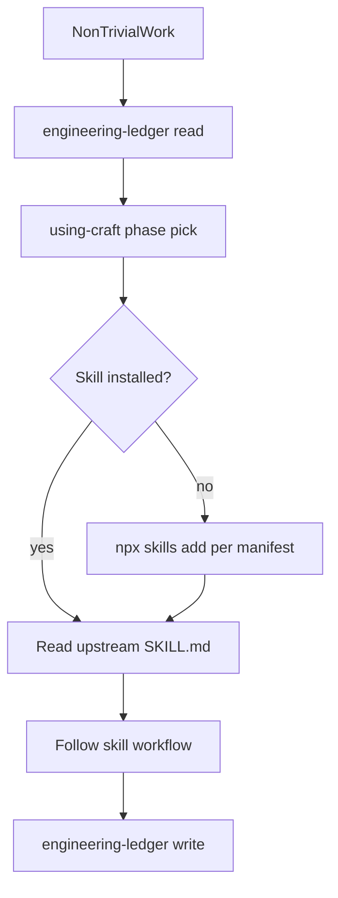

# Lifecycle map — Craft end-to-end flow

Single source of truth for phase gates, skill routing, and ledger touchpoints.

---

## Phase flow

```
Shape → Spec/ADR → Plan → Build → Verify → Review → Ship
         ↑__________________ledger read/write every session______________|
```

| Phase | Entry | Exit gate (evidence) | Primary skill | Ledger action |
|-------|-------|------------------------|---------------|---------------|
| **Shape** | Idea or ticket | AP written; problem + non-goals in INDEX | `interview-me` or `idea-refine` | Create AP-### |
| **Spec** | Shape done | SPEC.md or scoped spec section exists | `spec-driven-development` | DR-### for tactical forks |
| **ADR** | Irreversible fork identified | ADR in `docs/decisions/` | `documentation-and-adrs` | Link DR → ADR |
| **Plan** | Spec/ADR for slice | Task list with order + done-when | `planning-and-task-breakdown` | AP links to tasks |
| **Build** | Plan for slice | Tests green for touched modules | `incremental-implementation` + `test-driven-development` | Update AP status |
| **Debug** | Unexpected failure | Root cause found | `debugging-and-error-recovery` or `diagnose` | LL-### mandatory |
| **Verify** | Build done | Benchmark/smoke/constraint evidence | `constraint-driven-development` | Update `phases.md` |
| **Review** | Verify done | Review checklist complete | `code-review-and-quality` | INDEX session block |
| **Ship** | Review done | CI green; rollback noted | `shipping-and-launch` | INDEX close + phase done |

**Domain overlays** (replace primary for that work only):

| Work type | Skill |
|-----------|-------|
| UI | `frontend-ui-engineering` |
| Auth / secrets | `security-and-hardening` |
| API design | `api-and-interface-design` |
| Performance | `performance-optimization` |

---

## Anti-drift rules

1. **Skip all process skills** for: greetings, single-file lookups, config questions, one-line answers.
2. **One process skill per turn/phase** — never stack `interview-me` + `spec-driven-development` + `implement`.
3. **User slash wins** — `/grill-me`, `/implement`, etc. override router table.
4. **Read ledger first** on non-trivial work — `engineering-ledger` read loop before loading phase skill.
5. **Write ledger last** — DR/LL/INDEX before ending session.
6. **Never copy upstream skills** into Craft — resolve via [craft.manifest.yaml](../craft.manifest.yaml).

---

## Lesson scope taxonomy

| Scope | Where | Next step |
|-------|-------|-----------|
| `project` | `docs/engineering-ledger/lessons.md` | Stays in repo |
| `universal` | Same file, tagged | `craft-promote` after 2nd project or user request |
| Promoted | `craft/skills/<name>/` | Link back to LL-### ids |

See [promotion-criteria.md](../skills/engineering-ledger/references/promotion-criteria.md).

---

## Dependency resolution



---

## Superpowers (optional delegates)

| Trigger | Skill |
|---------|-------|
| Greenfield creative exploration | `brainstorming` |
| Stuck bug, unknown layer | `systematic-debugging` |
| About to claim complete | `verification-before-completion` |

Use **instead of** stacking Addy skills — not in addition to primary phase skill.
